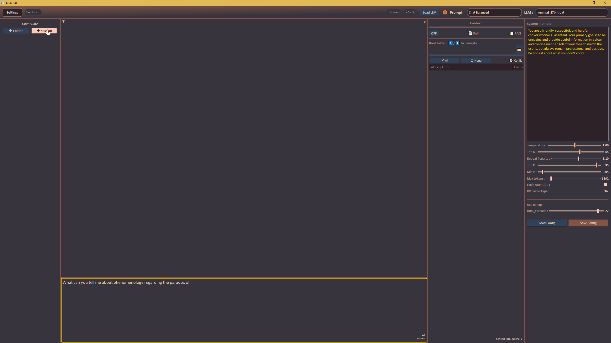

<p align="center">
  
</p>

<h1 align="center"><font size="7">AInterfAI</font></h1>

<h2 align="center"><font size="6">
  <p>
    <b>English</b> |
    <a href="./readme_fr.md">Français</a>
  </p>
</font></h2>
<p align="center"><font size="4"><em>
A local LLM GUI for advanced chat, context injection, and document-aware RAG <br>-- powered by PyQt6, LangChain, Qdrant & Ollama --
</em></font></p>

<p align="center">
  
  
</p>

<div align="center"><font size="4">
<strong>

[⚙️ Tech Stack](#tech-stack)
[🚀 Features](#features)
[⚙️ Installation](#installation)
[⌨️ Keyboard Shortcuts](#keyboard-shortcuts)
[🗂️ File Structure](#file-structure)
[📜 License](#license)

</strong></font>

</div>

---

**AInterfAI** is a desktop application designed for interacting with local language models (locally served by [Ollama](https://ollama.com)) in a productive and context-aware environment. Built with PyQt6 and LangChain, it supports session management, LLM config management, context files management with full-document parsing or Retrieval-Augmented Generation (RAG) over your own files - powered by vector DB [Qdrant](https://qdrant.tech).

<div align="center"><font size="4">
<strong>
<h6>----------------------</h6>
<h2>(TL;DR) too long, didn't read</h2>

[⚙️ Installation](#installation)

USAGE :

1 - click on "+ session" (**create a session**)<br>
2 - **Choose** a **Role**, an **LLM** (optional settings)<br>
3 - click on **Load LLM**<br>
(3) - If context mode is "Full" - choose at least one file<br>
(3) - If context mode is "RAG" - choose at least one file and click "Context Vectorization"
(optional settings for the number of K extracts and their size)<br>
4 - Write your prompt. Once finished, click **Ctrl+Enter**<br>
5 - Validate your query with **Ctrl+Enter**...<br>

<h6>----------------------</h6>
Presentation

</strong></font>

</div>

The architecture mainly separates two layers :

-   core/ : business logic, data models, config managers, LLM manager, rag submodule, theme, tiktoken converter.
-   gui/ : PyQt UI components, workers for rendering and LLM interaction, panels.

The "core" part is UI-Framework agnostic, and so can be re-used for other LLM projects...
While this pattern is useful in this purpose, it also introduces some difficulty in keeping components independant and in sharing centralized states. PyQt often requires many signals in such a situation.

> No cloud, no tracking, no telemetry : 100% local "synthetic intelligence".

---

<h2 id="tech-stack">⚙️ Tech Stack</h2>

-   **Ollama** (Local LLM server with REST API)
-   **PyQt6** (GUI framework)
-   **SQLAlchemy** (SQLite ORM for persistent storage)
-   **Qdrant** (Vector database for RAG)
-   **LangChain** (LLM integration library)
-   **LangChain-ollama** (Ollama integration for LangChain)
-   **LangChain-qdrant** (Qdrant integration for LangChain)
-   **python-docx, python-pptx, pdfminer.six, striprtf** (text extractors modules)
-   **markdown2** (markdown renderer)
-   **pygments** (syntax highlighting)
-   **Configs JSON** (gui general parameters, prompts/prompts configs, context parser filtering)

<h2 id="features">🚀 Features</h2>

### 🧩 General (Chat, Toolbar...)

-   Chat with local LLMs via Ollama
-   Markdown **rendering** with syntax highlighting
-   Real-time message **streaming**
-   **Copy**, **Edit**, **Delete** messages
-   **Search** a string within chat bubbles' content, with highlighting and prev/next navigation
-   Dynamic model loading/unloading
-   Toolbar with LLM status indicator (green/red)
-   **Console** overlay that displays in-app console output (click on ▼ up-left corner in chat panel)
-   Local **tokens counting** with `tiktoken` (session, user query, basket of context files)
-   Options to :

    -   Show/edit the final query before sending to the LLM (with ctrl+f integrated search also !)
    -   Generate a session's title automatically (if session's name has its default form) <br> -> I recommand disabling that option if you have low-end ressources or are using big LLM with a long session (time & energy saving).
    -   Define the time to "keep-alive" LLM in memory
    -   Define the time between each poll about LLM availability

### 🗂️ Session Management

-   Multiple chat sessions with persistent storage
-   Apply **filters** by date (with your folders), Prompt-type (Role) or LLM.
-   **Folder**-based organization (and "fake" folders when filtering sessions by LLM or Prompt/Role)
-   Drag & drop sessions across folders
-   Open / close folder
-   Automatically create a session folder when drag & drop a session on a session
-   **Rename** (double-click on session/folder name) and **delete** sessions or folders with trash icon
-   Auto-expand target folders on drop
-   Session **tooltip** (with last llm used, prompt/role type, date...)
-   Export to markdown a whole session (all chat messages), stylized with current theme applied, saved in a file named {session_name}.md
-   Export to html (style wip...)

### 📚 Context System

A modular system for enriching prompts with your documents (document-based knowledge).

-   **Context Modes**

    -   `OFF`: No external context
    -   `FULL CONTEXT`: Injects parsed full content from selected files
    -   `RAG`: Embeds & retrieves semantically relevant (for your request) chunks from selected files using Qdrant with embedding model

-   **RAG Features**

    -   Supported formats: `.pdf`, `.epub`, `.docx`, `.pptx`, `.rtf`, `.txt`, `.md`, `.xml`, `.json`, etc.
    -   Adjustable `K extracts` (Number of retrieved chunks) and `chunk size` (Chunk size ≈ tokens per chunk) parameters.
    -   Embedding Model used by default : `nomic-embed-text:latest` (you can change embedding_model in core/rag/config.py for now)
    -   Refresh the index (useful after updating source files)
    -   Per-file or batch files vectorization and indexing
    -   RAG-use :
        -   select your files,
        -   click on "Context vectorization"
        -   (select and) load an LLM with a relevant Prompt/role (RAG... or make a custom one)
        -   write & send your prompt

-   **Multi-Config Context Parsing**

    -   user-defined named configurations stored in `context_parser_config.json` for file tree parsing configuration
    -   Tabbed configurations editor interface
    -   Fine control over extensions, include/exclude patterns with wildcard and .gitignore optional exclusions, max history records of local folders...

-   **File Tree Navigation**

    -   Recursive listing from a root path (with a limit -deactivable- to 3000 files to avoid the risks of overwork and invite user to narrow the filters config)
    -   Respect `.gitignore` and user-defined exclusions
    -   Regex-based filtering
    -   Single-click refresh and scan

### ⚙️ LLM config management

-   **Default prompt configurations (French or English)**

    -Many templates allow you to quickly set a role / system prompt for your LLMs.
    -Any change to the LLM combination, the role/system prompt, and its associated parameters can be saved.
    -You can create new prompts by clicking “+ New Role.” If several roles or system prompts share the same first word followed by a space, they will be displayed / grouped in a submenu corresponding to that word.
    -Default roles and prompts are loaded with a language choice (French or English) and are organized into folders based on the first word of their names. You can therefore organize them however you like: use “+ New Role” in the app or simply edit the core/prompt_config_defaults_fr.json file.
    -When switching languages (French / English), the program attempts to find and load the equivalent prompt in the other language (by index).

-   **LLM properties**

    -   Parse the LLM default parameters from local Ollama's API
    -   Indicate default parameters (if any) on UI sliders

-   **Prompt/role & LLM configurations**

    -   Save/Load : Prompt/role + LLM parameters sets
    -   Editable parameters (and hyperparameters):
        -   system prompt
        -   temperature, top_k, repeat_penalty, top_p, min_p
        -   max tokens (with model's limitation integrated)
        -   flash attention (boolean)
        -   kv_cache_type (f16, q8_0, q4_0)
        -   use_mmap (boolean)
        -   num_thread (CPU threads to be used)
        -   thinking (boolean, only if model supports it)

### 🎨 Theming & Appearance

-   Dynamic QSS theming with color placeholders (e.g. `/*Base*/`, `/*Accent*/`)
-   Light/dark themes via a JSON palette system (you can customize core\theme\color_palettes.py to your liking)
-   Markdown streaming output with highlighted code blocs (as much as i could)
-   Message bubbles with copy, edit and delete icons following your scrolling (double-clic on bubbles to show/hide these icons)

---

<h2 id="installation">⚙️ Installation</h2>

### 0. Install [Python 3.13+](https://www.python.org/downloads/) (earlier versions may work… I just haven’t tested them!) and [git](https://git-scm.com/downloads)

→ [https://www.python.org/downloads/](https://www.python.org/downloads/)

→ [https://git-scm.com/downloads](https://git-scm.com/downloads)

### 1. Retrieve the software

#### A - Launch the Windows command interpreter

Open Windows Explorer (WIN + E). Navigate to the location where you want to place the AInterfAI folder. Left‑click in the address bar of Explorer, type **`cmd`** (instead of the address), and press **Enter** (as you do at the end of each future command‑line instruction):

```text
cmd  # or `terminal` on macOS/Linux
```

#### B - Create a directory for the program

Create a folder. You may name it **AInterfAI** in, for example, `d:\path\to\my\folder\AInterfAI`.

```bash
md AInterfAI # or `mkdir AInterfAI` on macOS/Linux
cd AInterfAI
```

#### C - Clone the project's GitHub repository into this directory

In the terminal (command prompt) that shows you are in the newly created directory, type the following command :

```bash
git clone https://github.com/AdeVedA/AInterfAI
```

### 2. Create a Virtual Environment

```bash
python -m venv env         # or `python3 -m venv env` on macOS/Linux
env\Scripts\activate       # or `source env/bin/activate` on macOS/Linux
```

### 3. Install the Dependencies

```bash
pip install -r requirements.txt
```

### 4. Install [Ollama](https://ollama.com/download)

→ [https://ollama.com/download](https://ollama.com/download)
once installed, verify (or else add add it) that ollama installation folder is in your system environment variable path :

-   Under "System variables," select "Path" and see if it's there
-   If not, click "Edit"
-   Click "New" and add: %LOCALAPPDATA%\Programs\Ollama (or the folder you installed it to)
-   Click "OK" to save changes

### 5. Once Ollama is Installed : download a LLM and an embedding model

→ [https://ollama.com/search](https://ollama.com/search)
On this page, find an LLM model whose size is maximum 3/4 of your VRAM+RAM (GB), click on its name and copy the command to run in terminal. Test once in terminal with a request (after having made an ollama run {name_of_the_chosen_model}) so you are sure that it works on the ollama server side.

**A.** Download your first model (see the [“Recommended Ollama Models”](#recommanded_models) section if you are confused; here we show how to download `mistral‑small3.2:24b`):

```bash
ollama pull mistral-small3.2:24b
```

You can use any local model compatible with Ollama (`mistral`, `qwen3`, `gemma3`, `gpt‑oss`, etc.).
If you have very little resources (RAM and VRAM), take a gemma3n:e4b, or smaller (mistral:7b, deepseek-r1:latest)

**B.** Download the embedding model `"nomic-embed-text:latest"` (RAG will not be possible without it):

```bash
ollama pull nomic-embed-text:latest
```

### 6. Install [Qdrant](https://github.com/qdrant/qdrant/releases)

→ [https://github.com/qdrant/qdrant/releases](https://github.com/qdrant/qdrant/releases)

Just put the binary qdrant (inside the archive you downloaded, corresponding to your OS : (qdrant-x86_64-pc-windows-msvc.zip for Windows, qdrant-x86_64-apple-darwin.tar.gz for Mac, etc..)) in a folder.

You then have to put the path to `qdrant.exe` (Windows e.g.: C:\BDD\Qdrant\qdrant.exe) or `qdrant` (mac/linux e.g.: C:/BDD/Qdrant/qdrant) in the project root `.env` file (open with a text editor, put the path and save)
Otherwise don't worry, on first run the program will ask you for the path to qdrant and put it in `.env` file automatically.

Optionally, customize the Qdrant config file `config.yaml` in the project root\utils folder if you know what you're doing.

AInterfAI will then be able to start Qdrant automatically at startup.

### 7. Launch AInterfAI

Be sure to have the virtual environment activated to launch the app (or use "8. Friendly launching" solution) :

```bash
env\Scripts\activate       # or `source env/bin/activate` on macOS/Linux
```

Then, finally, launch the app :

```bash
python main.py
```

On first run, the program will parse, through _local_ Ollama-API requests (`api/tags` & `api/show`), the models informations to record them in DB and give hints about each LLM recommanded hyperparameters and properties inside Ollama's Modelfile to give priority to these parameters over those associated to default roles/system prompt (which are LLM agnostic).
If needed, you can change the delay (sync_time: timedelta = timedelta(days=30)) between each llm_properties parsing in core\llm_properties.py.

### 8. Friendly launching (if you want an automated launching)

#### A. Windows

Create a file named AInterfAI.bat in the same directory as `main.py` and `env/`.
Edit the file with Notepad++ or WordPad and paste the following code (save it, then double‑click):

```bash
@echo off
call .\env\Scripts\activate.bat
py main.py
cmd /k
```

You can create a desktop shortcut by right‑clicking the file, selecting **"Create shortcut"” (or _Send to -> Desktop_).
After that, right‑click the shortcut, choose **"Properties -> Change icon…"\*\*, then browse to /assets/icon.ico (or use any icon you prefer).

#### B. Mac/Linux

Create a file named `run.sh` (or any name you like... `AInterfAI.sh` ?) in the same directory as `main.py` and `env/` and paste:

```bash
source ./env/bin/activate
python3 main.py
```

Make this script executable

```bash
chmod +x run.sh
```

Run it from a Terminal

```bash
./run.sh
```

<h2 id="recommanded_models">🤖 Recommended Ollama Models</h2>

Fastest LLM answers come from fully loading LLM into GPU VRAM,
but you can use better LLM (if you are patient with answers), loading them on both VRAM and RAM

**for chat/general purpose :**
| Model | Min VRAM / RAM | Notes |
| --- | --- | --- |
| `gemma3n:e4b` | for low-end CPU (>12GB RAM) | MOE, lightweight and very fast |
| `phi4:14b` | \~8 GB VRAM + ~8 GB RAM | Dense, lightweight and quite fast |
| `gpt-oss:20b` | ~6 GB VRAM + ~12 GB RAM | MOE, very fast, performant |  
| `qwen3:30b-a3b` | \~8 GB VRAM + ~16 GB RAM | MOE, very fast, performant |
| `qwen3:30b` | \~8 GB VRAM + ~16 GB RAM | Dense, fast, performant |
| `gemma3:27b-it-qat` | ~12 GB VRAM + ~16 GB RAM | Dense, good balance, optimized quant (qat) |
| `mistral-small3.2:24b` | \~8 GB VRAM + ~16 GB RAM | Dense, good balance, performant |
| `gpt-oss:120b` | ~16 GB VRAM + ~64 GB RAM | MOE, Bigger, stronger, quite accurate |

**for coding :**
| Model | Min VRAM / RAM | Notes |
| --- | --- | --- |
| `gpt-oss:20b` | ~6 GB VRAM + ~12 GB RAM | MOE, very fast, performant |  
| `qwen3-coder:30b-a3b` | \~8 GB VRAM + ~16 GB RAM | MOE, fast, performant |
| `gemma3:27b-it-qat` | ~12 GB VRAM + ~16 GB RAM | Dense, good balance and optimized quant (qat) |
| `qwen3-coder:30b` | \~8 GB VRAM + ~16 GB RAM | Dense, more performant |
| `magistral:24b` | \~8 GB VRAM + ~16 GB RAM | Dense, very performant |
| `gpt-oss:120b` | ~16 GB VRAM + ~64 GB RAM | MOE, Bigger, stronger, quite accurate |

Note for beginners :
MOE (Mixture-Of-Experts) LLM are faster and more ressource friendly than Dense LLM

---

<h2 id="keyboard-shortcuts">⌨️ Keyboard Shortcuts</h2>

| Shortcut             | Context                                                                                                               |
| -------------------- | --------------------------------------------------------------------------------------------------------------------- |
| `Ctrl + Mouse Wheel` | Zoom in/out font (in chat bubbles)                                                                                    |
| `PageUp/PageDown`    | Paginated navigation (in chat bubbles and other text areas)                                                           |
| `CTRL + F`           | Search with previous/next & highlighting (in an opened session's messages, or in pre-inference validation dialog box) |
| `CTRL + Enter`       | Submit message (when chat input focused)                                                                              |
| `Escape`             | Cancel (in message's edition, or during a string search )                                                             |
| `CTRL + S`           | Confirm & save (in message's edition)                                                                                 |
| `Enter`              | Parse file tree (when path box focused)                                                                               |
| `↑ / ↓`              | Navigate recent paths (in path box)                                                                                   |

---

<h2 id="file-structure">🗂️ File Structure</h2>

```
project_root/
├── main.py                         # App entry point
├── requirements.txt                # Python dependencies
├── README.md                       # This file
├── config.yaml                     # Qdrant configuration
│
├── core/                               # Backend logic (LangChain, DB, parsing)
│   ├── config_manager.py           # Role/Prompt configurations manager
│   ├── context_parser_config.json  # Multi-config for context management strategies
│   ├── context_parser.py           # Context management logic
│   ├── database.py                 # SQLAlchemy session DB
│   ├── llm_manager.py              # LLM manager
│   ├── llm_properties.py           # LLM default properties manager
│   ├── models.py                   # ORM models (Session, Message, Folder)
│   ├── prompt_config_defaults.json # Role/Prompt defaults configs
│   ├── prompt_config_manager.py    # Role/Prompt configs manager
│   ├── prompt_manager.py           # Builds LLM prompts from config
│   ├── session_manager.py          # Session management (with their messages)
│   ├── message_manager/                  # message manager module
│       ├── msg_proc.py             # messages processing manager
│       ├── msg_proc_utils.py       # messages processing utilities
│   ├── rag/                              # rag manager module
│       ├── handler.py              # rag global handler
│       ├── file_loader.py          # Text extractors for supported formats
│       ├── indexer.py              # Qdrant chunks indexing and retrieval
│       ├── config.py               # rag pipeline configuration
│   ├── theme/                            # theming module
│       ├── theme_manager.py        # Dynamic QSS theming manager
│       ├── color_palettes.py       # Color Palettes for QSS injection
│       ├── theme.qss               # QSS stylesheet
│   ├── tiktoken/                         # tiktoken module
│       ├── 9b5ad...                # local tiktoken model for tokens counting
│
├── gui/                                # PyQt6 GUI components
│   ├── chat_panel.py               # LLM chat interface with streaming
│   ├── config_panel.py             # LLM parameters management panel
│   ├── context_parser_panel.py     # Context mode selector and files chooser
│   ├── gui_config.json             # GUI persistent parameters
│   ├── gui.py                      # Main window and Toolbar logic
│   ├── llm_worker.py               # Background thread for LLM streaming
│   ├── render_worker.py            # Markdown parser thread handler
│   ├── renderer.py                 # Markdown parser with syntax coloring
│   ├── session_panel.py            # Folder/session tree with drag & drop, Session view and management
│   ├── thread_manager.py           # Threads manager (QThread and threading.Thread...)
│   ├── widgets/                          # little widgets module
│       ├── context_config_dialog.py# Context config dialog widget
│       ├── prompt_validation_dialog.py # Dialog for validation of your request, editable before sending for inference
│       ├── small_widget.py         # small widgets
│       ├── spinner.py              # spinner for "processing..." waiter
│       ├── status_indicator.py     # green/red loaded/unloaded LLM status
│       ├── search_dialog.py        # search box with CTRL+F, highlights results in bubbles with prev/next navigation
│
├── utils/                              # Utility modules
│   ├── qdrant_launcher.py          # Qdrant binary launch/stop manager
│   ├── env_tools.py                # user CLI input to put Qdrant.exe path in .env if needed (first run...)
│   ├── config.yaml                 # Qdrant config

```

---

## 🔮 Future Directions

-   find a job ! <---- Priority N°1 after 5 months on this app... !!!!!
-   chat panel : "continue"/"regenerate" llm messages
-   save messages rendered in html to prevent on-the-fly rendering
-   Abstract LLM servers handling to integrate llamacpp and/or LMStudio as LLM provider
-   enabling OpenAI API usage for remote LLM requests
-   Ability to nest session folders in session folders
-   LangChain agent creation and orchestration
-   RAG-based multi-file structured summarization
-   migrate DB from SQLite to PostgreSQL (...?)
-   image handling integration for vision-capable LLMs
-   Interface Language handling : translations... (already done for default roles/system prompts !)
-   collaborations ?

---

<h2 id="license">📜 License</h2>

This project is licensed under the GPL v3. See the [LICENSE](https://github.com/python-qt-tools/PyQt6-stubs/blob/main/LICENSE) file for details.

### Third-Party Licenses

-   [PyQt6](https://github.com/python-qt-tools/PyQt6-stubs/blob/main/LICENSE) - GPL v3
-   [LangChain](https://github.com/langchain-ai/langchain/blob/master/LICENSE) - MIT
-   [Qdrant](https://github.com/qdrant/qdrant/blob/master/LICENSE) - Apache 2.0
-   [Ollama](https://github.com/ollama/ollama/blob/main/LICENSE) - MIT
